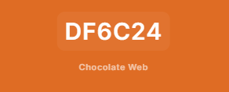
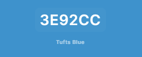
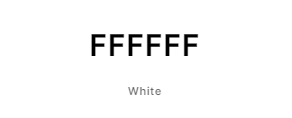

# Mars Colony One
## **Site Overview**

This site is a demonstration of my front end design skills in pure HTML and CSS.

The site is designed for a fictional company called StarSeed industries, who are a market leader in space exploration.
The company is starting recruitment for civilian colonists to be part of StarSeeds Mars colony "Mars Colony One"
The objective of the site is to capture the attention of possible colonists, provide details about the mission, and collect contact information from visitors that wish to apply.
​

#### [The live website is here](https://will-griffiths-ireland.github.io/Mars-Colony-One/)​

## Table of contents:
1. [**Site Overview**](#site-overview)
1. [**Planning stage**](#planning-stage)
    * [***Planning Overview***](#planning-overview)
    * [***Target Audiences***](#target-audiences)
    * [***User Stories***](#user-stories)
    * [***Site Aims***](#site-aims)
    * [***Wireframes***](#wireframes)
    * [***Color Scheme***](#color-scheme)
    * [***Typography**](#typography)
1. [**Site-Wide Features**](#site-wide-features)
    * [***Page Background***](#page-background)
    * [***Header Element:***](#header-element)
    * [**Footer**](#footer)
1. [**Individual Page Content features**](#individual-page-content-features)
    * [**Intro Page Content**](#intro-page-content)
    * [**Mission Page Content**](#mission-page-content)
    * [**Mars Page Content**](#mars-page-content)
    * [**Ship Page Content**](#ship-page-content)
    * [**Trip Page Content**](#trip-page-content)
    * [**FAQ Page Content**](#faq-page-content)
    * [**Sign-up Page Content**](#sign-up-page-content)
1. [**Future-Enhancements**](#future-enhancements)
1. [**Testing Phase**](#testing-phase)
1. [**Deployment**](#deployment)
1. [**Technology**](#technology)
1. [**Credits**](#credits)
    * [**Honorable mentions**](#honorable-mentions)
    * [**General reference**](#general-reference)
    * [**Content**](#content)
    * [**Media**](#media)

---

## **Planning Stage**

### **Planning Overview:**

I gave a lot of thought to producing a site that was an example of somethign a large company/corp would produce.

* The site aims to be a sleek promotion of their project/mission
* My focus is to captivate the user and keep them wanting more
* My design is bold and minimalist

### **Target Audiences:**

* Users interested in space travel 
* Users interested in new work oppertunities
* Users interested in a new life challange
* Users not sure what to do with their life (adolesents)
* Users previously involved in work within challanging enviroments
* Users formaly involed in space industry

### **User Stories:**

* As a user, I want to quickly understand the purpose of the site and its core message
* As a user, I want to navigate through content easily
* As a user, I want to learn more about what oppertunities there are for me on Mars
* As a user, I want to learn about the technolgy the company uses
* As a user, I want to easily submit my details so I can be contacted
* As a user, I want to easily view the site with whatever device and browser I am using 

### **Site Aims:**

* Core aim is to generate as much interest as possible in the mission and for users to provide their contact details for recruitment followup
* To help the user understand the mission to colonise mars
* To provide key details about what they can do on mars
* To provide key details about the living conditions
* To get contact information from the user for future recruitment

### **Wireframes:**

Wireframes were built in Balsamiq as a foundation and there has been an organic evolution of the design during construction of the site and testing across the different devices I had available.

Original wireframs in PDF [here](./docs/mco-wireframe.pdf)
​
### **Color Scheme:**

My aims for the color scheme​.

* High contrast
* Complimentary colors
* Dark/space theme

I leveraged https://coolors.co/ during the process.

I took inspiration for the core color from Mars itself and built out from that.
I used a colour picker on the image of mars to pull out the hex of a color I like to start with.

In contrast to the rich orange of mars I have used pure black to match with the void of space.

I've also used a light blue which I see as introducing a link to planets atmospheres and a connection to life, water, and hope. I feel the use brings balance to the overall feel of the site. Used in a graduated form across the header to keep that atmospheeric theme across all pages.

Used sparingly and with opacity, I have a plum colour. This was to add a little varation where it felt right.

Finally the core font color is pure white. This is not only for contract but also represents the pure white light of the sun.

### **Typography**
​
I was aiming for a sci-fi looks and feel without going overboard and alianting users
The logo and heading use Exo 2 font
Arial is used as a fallback.

## **Site-Wide Features**
​
### **Site Logo**

The page logo embraces a simple sci-fi astectic
Using Exo 2 font to look modern/futurist while still highly readable.
I used a transition on a globe icon to act as the "O" in One. This globe icon is used throughout the sites images as an anchor to build fimiliiarty

### **Navigation Bar**
This is an example of the features section, your going to talk about each section of the page and what it offers for the navbar for example

### **Page Background**

At first I used pure black as the background for all pages but it didn't have the right feel/depth

I tried different solid colors and images but they were either too flat or far too busy for my astetic.

Finally I created a small image and and added random pixels, this image is repeated across x/y for a starfield background.

​
## **Individual Page Content features**

### **Intro Page Content**

I used index.html as an intro page

### **Mission Page Content**

Images and text slide in from the side
mission image is a artistic impression of the colonist on mars and the use of circle shape and transparentcy links the picture to the clasic image of mars

The image of the founder and his companies logo bring punch and credibility to the mission as they are well known
​
* This is where you will place all of your features think about each section of the page include a screenshot and a few bullet points on how it's presented and why

### **Mars Page Content**

* This is the info about the mars page

### **Ship Page Content**

* This is the info about the ship page

### **Trip Page Content**

* This is the info about the trip page

### **FAQ Page Content**

* This is the info about the faq page

### **Sign-up Page Content**

* This is the info about the sign-up page

---
​
## **Future-Enhancements**
​
* user account creation
* user application tracking
* interactive 3d model of Jagger I Ship

​
​
## **Testing Phase**

Testing was perfomred throught development of the site and led to design evolution as I gained deeper understanding of what was possible.

### **Validators**

| File | Result | Comments |
| ----------- | ----------- | ---- |
| index.html | Pass | N\A|
| Paragraph | Text |

​
* Responsiveness - How do you test this, dev tools? checking on multiple devices?
​
* Functionality - Each feature needs to be tested before something is complete, talk about the process, click each link check each image, does form validation work, if your using javascript or anything else, does it always behave as the user expects
​
* Validators - Here include images from w3c html validator and css jigsaw (jshint for js and pep8 for python) and the results that came from it
​
​
## **Bugs**
​
We always have bugs in development, a few bullet points here to talk about bugs you found and how you fixed them, in later projects this will be more detailed
​
* Issue - When on mobile the user had horizontal scroll with items overflowing
* Cause - The images had absolute positioning and caused them to go off screen
* Resolution - Changed the width of the image to stay within the confines of the screen.
​
***
## **Deployment**
I deployed the page on GitHub pages via the following procedure: -
​
1. From the project's [repository](pageurl), go to the **Settings** tab.
2. From the left-hand menu, select the **Pages** tab.
3. Under the **Source** section, select the **Main** branch from the drop-down menu and click **Save**.
4. A message will be displayed to indicate a successful deployment to GitHub pages and provide the live link.
​
You  can find the live site via the following URL - [live webpage](https://yoururlhere)
***
​
## **Technology**
​
These are the technoligies used for this project.

​
- HTML5
- CSS3
- Javascript (Only for fontawesome)
- Powerpoint (Initial Logo Creation) 
- Paint.net (Image editing/sizing/compression)

My approach was to start from a blank canvas really try to build out my vision without using a lot of content​

----

## **Credits**
### **Honorable mentions**
​
Thanks to my mentor Richard
​
### **Content:**
​
I used code from https://alvarotrigo.com/blog/hamburger-menu-css/ example 1
This was used as a starting point for the advanced animations but I made extensive changes to make the menu fit my sites style
  
### **Media:**
​
Links to the locations of images if you've used them from an online source!
