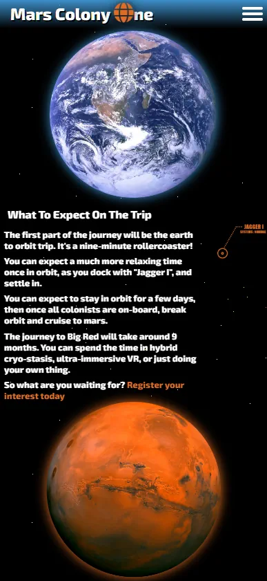

# Mars Colony One
## **Site Overview**

This site is a demonstration of my front-end design skills in HTML and CSS.

The site is designed for a **fictional** company called StarSeed industries, who are a market leader in space exploration.
The company is starting recruitment for civilian colonists to be part of StarSeeds Mars colony "Mars Colony One".
The objective of the site is to capture the attention of possible colonists, provide details about the mission, and collect contact information from visitors that wish to apply.
​

#### [The deployed website is here on GitHub Pages](https://will-griffiths-ireland.github.io/Mars-Colony-One/)​

## Table of contents:
1. [**Site Overview**](#site-overview)
1. [**Planning stage**](#planning-stage)
    * [***Planning Overview***](#planning-overview)
    * [***Target Audiences***](#target-audiences)
    * [***User Stories***](#user-stories)
    * [***Site Aims***](#site-aims)
    * [***Wireframes***](#wireframes)
    * [***Color Scheme***](#color-scheme)
    * [***Typography***](#typography)
1. [**Site-Wide Features**](#site-wide-features)
    * [***Site Logo***](#site-logo)
    * [***Navigation Bar***](#navigation-bar)
    * [***Page Background***](#page-background)
    * [***Footer***](#footer)
    * [***Navigation Flow***](#navigation-flow)
1. [**Individual Page Content features**](#individual-page-content-features)
    * [***Intro Page Content***](#intro-page-content)
    * [***Mission Page Content***](#mission-page-content)
    * [***Mars Page Content***](#mars-page-content)
    * [***Ship Page Content***](#ship-page-content)
    * [***Trip Page Content***](#trip-page-content)
    * [***FAQ Page Content***](#faq-page-content)
    * [***Sign-up Page Content***](#sign-up-page-content)
1. [**Testing Phase**](#testing-phase)
    * [***Validators***](#validators)
1. [**Deployment**](#deployment)
1. [**Technology**](#technology)
1. [**Future-Enhancements**](#future-enhancements)
    * [***User Enhancements***](#user_enhacements)
    * [***Internal Enhancements***](#internal_enhacements)
1. [**Credits**](#credits)
    * [**Honorable mentions**](#honorable-mentions)
    * [**Content**](#content)
    * [**Media**](#media)

---

## **Planning Stage**

### **Planning Overview:**

I gave a lot of thought to producing a site that was an example of something a large company/corp would produce.

* The site aims to be a sleek promotion of their project/mission
* My focus is to captivate the user and sell the dream of living on Mars
* My design is bold and minimalist
* Highly responsive from ultra-wide desktops down to mobile phones

### **Target Audiences:**

* Users interested in space travel 
* Users interested in new work opportunities
* Users interested in a new life challenge
* Users not sure what to do with their life (adolescents)
* Users previously involved in work within challenging environments
* Users formally involved in space industry

### **User Stories:**

* As a user, I want to quickly understand the purpose of the site and its core message
* As a user, I want to navigate through content easily
* As a user, I want to learn more about what opportunities there are for me on Mars
* As a user, I want to learn about the technology the company uses
* As a user, I want to easily submit my details so I can be contacted
* As a user, I want to easily view the site with whatever device and browser I am using 

### **Site Aims:**

* Core aim is to generate as much interest as possible in the mission and for users to provide their contact details for recruitment followup
* To help the user understand the mission to colonize mars
* To provide key details about what they can do on mars
* To provide key details about the living conditions
* To get contact information from the user for future recruitment

### **Wireframes:**

Wireframes were built in Balsamiq as a foundation and there has been an organic evolution of the design during construction of the site and testing across the different devices I had available.

Original wireframes in PDF [here](./docs/mco-wireframe.pdf)
​
### **Color Scheme:**

My aims for the color scheme​.

* High contrast
* Complimentary colors
* Dark/space/planet theme

I leveraged https://coolors.co/ during the process.

I took inspiration for the core color from Mars itself and built out from that.
I used a colour picker on the image of mars to pull out the hex of a color I like to start with.

In contrast to the rich orange of mars I have used pure black to match with the void of space.

I've also used a light blue which I see as introducing a link to planets atmospheres and a connection to life, water, and hope. I feel the use brings balance to the overall feel of the site. Used in a graduated form across the header to keep that atmospheric theme across all pages.

Used sparingly and with opacity, I have a plum colour. This was to add a little variation where it felt right.

Finally the core font color is pure white. This is not only for contract but also represents the pure white light of the sun.

### **Typography**
​
I was aiming for a sci-fi look and feel without going overboard and alianting users.

After much searching I chose https://fonts.google.com/specimen/Exo+2

I feel it strikes the right balance between readability and a modern futuristic look.

It's used with a bold weight of 800, which is unusual but it was a conscious design choice to have a chunky industry look across the entire site.

Sans-serif is used as a fallback.

## **Site-Wide Features**
​
### **Site Logo**

* The page logo embraces a simple sci-fi esthetic.
* Using Exo 2 font to look modern/futurist while still highly readable.
* The white text has a black drop shadow to add some depth.
* Globe Icon is used in place of the 'O' in One
* Simple 3d rotate on globe to be memorable but not annoyingly frequent
* Size scales down for lower res screens

### **Navigation Bar**

Across both mobile and desktop the header has at graduation from blue to transparent. This is to signify the transition from the surface of a planet to the atmosphere and allow a blend from the header into the body.

#### *Desktop*

The desktop navigation is done via simple hyperlinks across the top right of the page.

* Exo 2 Font
* Font size increase for higher width screens
* Small drop shadow to add depth
* Double dash indicates active page

When a user mouses over the links they change orange and have a white glow

#### *Mobile/Tablet*

On lower resolution screens the menu is hidden and replaced with a "burger" menu. I had played with other types of icons but felt they led to a confusing experience for the user.

Once clicked there is dropdown list

### **Page Background**

At first I used pure black as the background for all pages but it didn't have the right feel/depth

I tried different solid colors and images but they were either too flat or far too busy for my esthetic.

Finally I created a small image and and added random pixels, this image is repeated across x/y for a starfield background.

### **Footer**

The absence of a footer is a deliberate design choice as I felt this type of site would not benefit from one.

I did plan one in my wireframes but it didn't feel right so I took it out.

### **Navigation Flow**

The journey for the user should be a linear trip through each page on the site bar the FAQ.

The text within the page has links that lead the user towards the next page in the flow towards the sign-up.

An example from the mars page.

---
​
## **Individual Page Content features**

### **Intro Page Content**

I used index.html as an intro page to capture the users attention and generate a "wow" factor about Mars

* Animations fade in and out thought provoking text
* Animation simulate approaching Mars from afar
* Core site logo is introduced on a grand scale
* Link to skip to mission page for return visitors

#### *Desktop @1080p Example*

#### *Mobile Example*

### **Mission Page Content**

The mission page gets right to the point and explains to the user what this site is about and how they can play a part

* Animations bring content in from off screen left/right
* Colonist image was edited with circular transparency to allow a drop shadow filter. This is the blend the imagery of plant mars and its outer halo with the concept of exploration,
* The StarSeed logo relates to the company that is running this mission and brings the credibility of a well known brand. Again circular framing of the logo continues the theme
* The founder Stranto Marlini is a household name so his image and quote bring further credibility to the importance of the mission
* The founders image is also cut circular to allow a transparent background, a drop shadow filter is applied to the image to give it more impact.
* At lower mobile resolutions the layout is changed and font sizes are reduced

#### *Desktop @1080p Example*

#### *Mobile Example*

### **Mars Page Content**

* This page centers around the key activities that will take place
* Design is anchored to the mars image with 4 quadrants
* Short and pithy content that takes seconds to digest
* Icons are used to compliment the areas of focus
* Animations are limited to the full page fade in
* Reduced sizing keeps the layout with tweaks to font sizing

#### *Desktop @1080p Example*

#### *Mobile Example*

### **Ship Page Content**

* This page describes both vessels that will be used and their incredible technology
* Stock image of rocket was edited with MCO icons added
* Jagger I image was created in paint.net
* Mobile/tablet resolutions change to a different layout and sizing

#### *Desktop @1080p Example*

#### *Mobile Example*

### **Trip Page Content**

* The trip page gives high level details on the journey
* Gives users confidence in how easy it would be to go
* Earth and Mars images play a crucial visual role
* Animation of the trip is done with a scanner blip showing moving from Earth to Mars
* Mobile/tablet resolutions change to a different layout and sizing

#### *Desktop @1080p Example*

#### *Mobile Example*

### **FAQ Page Content**

* The FAQ page is not part of the core navigation flow
* Its a demonstration and its content is a nod at dark sci-fi humor
* Q&A are positioned over an image of somebody on Mars
* Mobile/tablet resolutions have changes to sizing and image position

#### *Desktop @1080p Example*

#### *Mobile Example*

### **Sign-up Page Content**

* This is the page where users can submit their contact details for future followup.
* Simple form layout with styles tweaked to match the rest of the site.
* Stock suit image edited with MCO icon to be really aspirational.
* Entices users to submit and be the next person with their name on a suit.

#### *Desktop @1080p Example*

#### *Mobile Example*

---
## **Testing Phase**

Testing was performed throughout development of the site and led to a design evolution as I gained deeper understanding of what was possible and how it looked.
Chrome was the main environment I worked in along with its Devtools.

I was somewhat obsessive about making the page scale from ultra-wide screens right down to mobiles.

Thankfully with a relatively simple website such as this the testing isn't too complex and boils down to things looking like they should and links working.
The biggest issue is cross browser compatibility and responsiveness.

I am learning more about testing and how to implement a structured test approach for future projects to be far more specific in my test plans.

All tests were performed across Chrome(Windows), Firefox(Windows), Edge(windows), Safari(IpadOS), Chrome(Android) and Samsung Internet(Android)
Hardware included a Windows 10 PC, Samsung Galaxy S22 Ultra, and an Apple Ipad Pro.

| Test Type | Chrome(Windows) | Firefox(Windows) | Edge(windows) | Safari(IpadOS) | Chrome(Android) | Samsung Internet(Android) |
| ----------- | ----------- | ---- | ---- | ----- | ----- | ---- |
| Text Displays | Pass | Pass | Pass | Pass | Pass | Pass |
| Text Correct Size | Pass | Pass | Pass | Pass | Pass | Pass |
| Images Display | Pass | Pass | Pass | Pass | Pass | Pass |
| Images Maintain Aspect Ratio | Pass | Pass | Pass | Pass | Pass | Pass |
| Links Work | Pass | Pass | Pass | Pass | Pass | Pass |
| Responsive | Pass | Pass | Pass | Pass | Pass | Pass |
| Animations Work | Pass | Pass | Pass |  P Fail | Pass |  P Fail |
| Form Works | Pass | Pass | EPass | Pass | Pass | Pass |

The 2 partial fails are covered in the defects section

### **Validators**

#### *HTML Validator*

To save screen space I've summarized the results

| File | Result | Comments |
| ----------- | ----------- | ---- |
| index.html | Pass | N\A |
| main.html | 1 Error | Div inside Label |
| mars.html | 1 Error | Div inside Label |
| ship.html | 1 Error | Div inside Label |
| trip.html | 1 Error | Div inside Label |
| faq.html | 1 Error | Div inside Label |
| faq.html | 1 Error | Div inside Label |

The only error I had was due to using a div within a label. This was part of the navigation menu code for mobile so comes up on

#### *CSS Validator*

| File | Result | Comments |
| ----------- | ----------- | ---- |
| index.html | Pass | N\A |
| Paragraph | Text | N\A |

#### *Lighthouse Results*

The call-out on lighthouse results is I got hit for image cache policy and also for contrast on the form, but I have hover styles that change the input boxes when user is typing so black on white should be full contrast

*Desktop*

*Mobile*

​
## **Defects**

Being a basic HTML/CSS site there were not many true bugs/defects.
I chalked most of my issues down to the learning process during development.

### **Resolved**

### **Unresolved**

*Safari*

* Odd animation glitch is seen in the top left of any page when it loads
* Clears up in a second and has no further impact to user experience
* No other browsers have this issue, it wasn't happening in Safari at first, not sure of the cause

*Lighthouse*

* During page tests in Lighthouse I was repeatedly getting a total failure and no results shown due to no lcp
* https://dev.to/roman_guivan_17680f142e28/google-lighthouse-failing-with-nolcp-error-1mjo
* Tried basic things and then made changes to opacity in animations seems to have resolved it and got results on all pages

## **Deployment**
I deployed the page on GitHub pages via the following the standard procedure: -
​
1. From the project's [repository](https://github.com/Will-Griffiths-Ireland/Mars-Colony-One), go to the **Settings** tab.
2. From the left-hand menu, select the **Pages** tab.
3. Under the **Source** section, select the **Main** branch from the drop-down menu and click **Save**.
4. A message will be displayed to indicate a successful deployment to GitHub pages and provide the live link.
​
You can find the live site via the following URL - [live webpage](https://will-griffiths-ireland.github.io/Mars-Colony-One/)

Deployment to another host is also possible

1. From the project's [repository](https://github.com/Will-Griffiths-Ireland/Mars-Colony-One), click **Code**.
2. Under the local tab click *Download Zip*.
3. Extract the files and copy them over to a webserver of your choice.

---
​
## **Technology**
​
These are the technologies used for this project.

- HTML5
- CSS3
- Javascript (Only for fontawesome)
- Powerpoint (Initial Logo Creation)
- Balsamiq for wireframes
- Paint.net (Image editing/sizing/compression)
- Github for version control and deployment
- Gitpod for development

----

## **Future-Enhancements**

I know there is always room for improvement and there are a number of things I would enhance. I was very much learning as I built and avoided copying code from examples (one exception noted in credits) so this did result in a lot of trial and error and superfluous css code.

### **User Enhancements**

* It woulds be great to implement full user account creation so users can see if/when they will be contacted.
* Expanded user data collection to get more details on the applicant so that and automated review process can be implemented as a first pass screening
* A fully interactive 3d version fo the colony ship 'Jaggar I' would be a great addition to the site. I had started some basic work in Blender on a model but the complexities of that and the javascript to display it left it beyond the scope for this initial project.

### **Internal Enhancements**

* I would do major code refactoring to make it as 'DRY' and well structured as possible. This would improve the ability for other developers to maintain it and also reduce bandwidth due to decreased file sizes. I appreciate that my knowledge evolved greatly during the first project and I will focus on structure and optimization right from the start going forward.
* Load smaller more compressed images at lower resolutions. This is another area I appreciate more now, in a heavily used production site every KB counts and not only means users see the content faster but also that costly bandwidth usage minimized

## **Credits**
### **Honorable mentions**
​
Thanks to my mentor Richard who provided valuable input and direction! I look forward to melting his mind during the next projects

Thanks to my partner Emma who is always so supportive! (she is still laughing at anyone naming something GIT, yes I did show her the GitHub site, it didn't help that the comedian Phil Wang has done a promo for them!)
​
### **Content:**
​
I used code from https://alvarotrigo.com/blog/hamburger-menu-css/ example 1
This was used as a starting point for the advanced animations but I made extensive changes to make the menu fit my sites style.
  
### **Media:**
​
I used a number of images from https://images.nasa.gov/ and https://unsplash.com/

